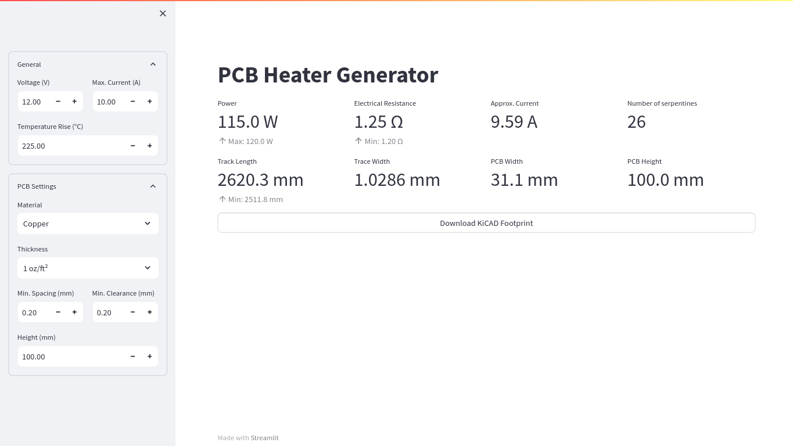

# PCB Heater Generator
[](/LICENSE)
[](/)

A streamlit based web app for generating serpentine patterned PCB traces for heating purposes.




## About
* Easy to run and play around with
* Prepared to support materials other than copper
* Prepared to support footprint file formats other than KiCAD.


## How to use
Set the voltage and maximum current you work with as well as the temperature rise you aim for in the *General* section of the sidebar. The PCB settings should work with the default settings of most manufacturers (copper traces @ 1 oz/ft², 0.2 mm clearance) and will result in a PCB height of 100 mm (the width is created dynamically according to your input). If you aim for specific dimensions set the CPB height in the *PCB Settings* section of the sidebar and modify the settings until the width matches your needs.

### Changing to more specific settings
Take a look at the *PCB Settings* section of the sidebar. There you'll find more advanced options like trace clearance, trace spacing, material choice and material thickness. These settings (especially the trace spacing) might help with achieving the dimensions you are looking for.

### Output
The output will be a serpentine patterned trace to place on your PCB. In the main body of the site you'll find the calculated properties of you result. If there are smaller annotations below it shows you the absolute minimum/maximum settings (e.g. with 12V @ 10A your minimum resistance MUST be 1.2Ω to prevent your PSU from damage, so the trace is generated to be this value *or higher*).

You can download your KiCAD-Footprint by clicking the `Download KiCAD Footprint` button.


## How to run
To run the app, clone the repository using git
```console
git clone https://github.com/bliepp/PCB-Heater-Generator.git
```
and install the dependencies via pip (a virtual environment is recommended)
```console
python -m venv .venv
source .venv/bin/activate
pip install -r requirements.txt
```
Now run the app with the streamlit CLI command
```console
streamlit run main.py
```
and open `http://localhost:8501/` in the webbrowser of your choice.

The default port is `8501`. To change the port, please see the streamlit help message

```console
streamlit run --help
```
